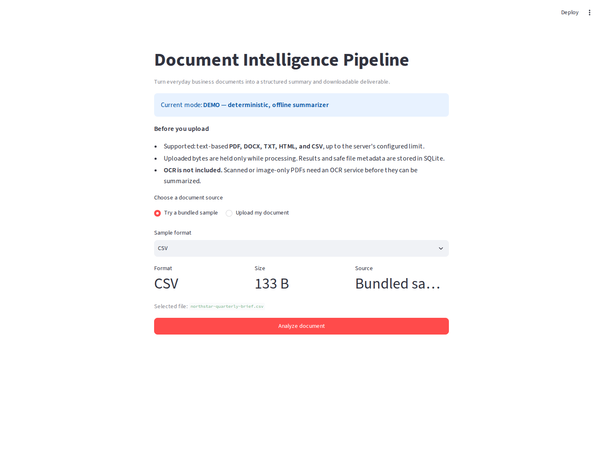
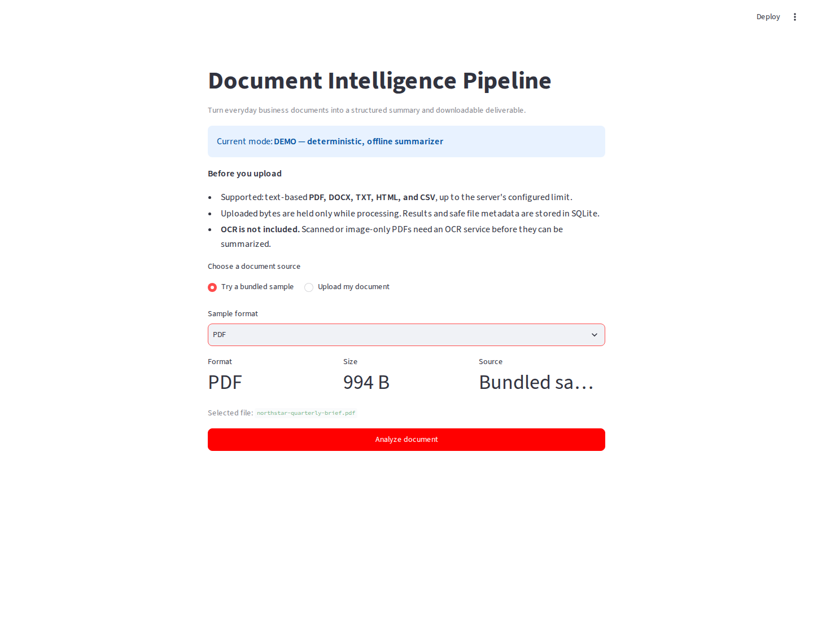
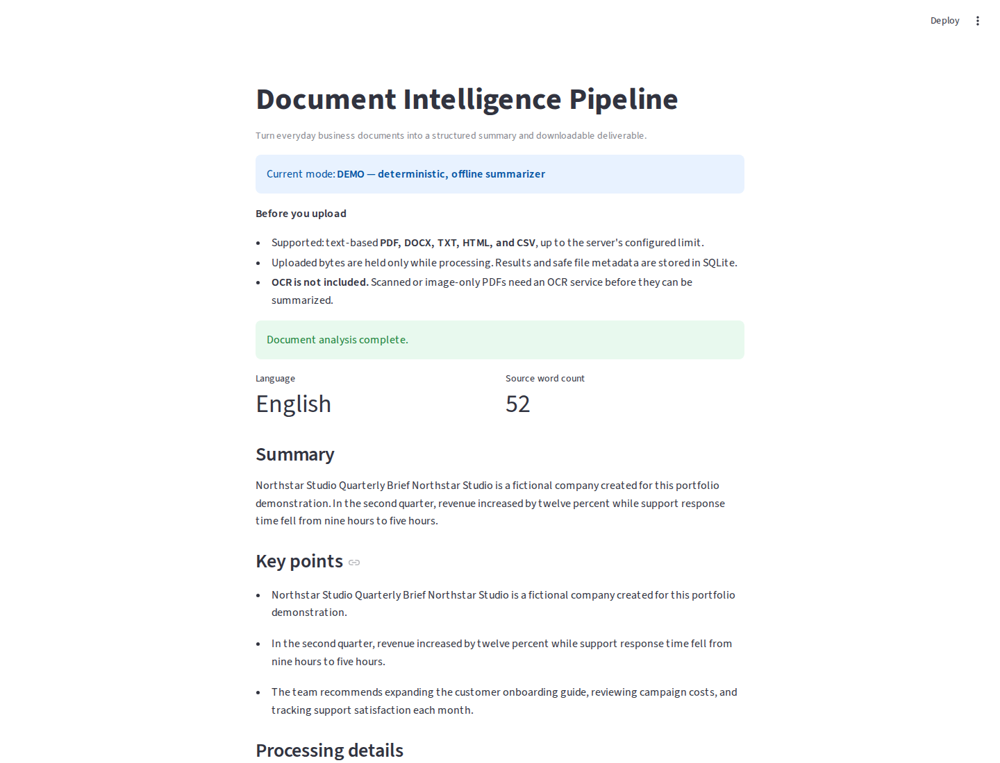
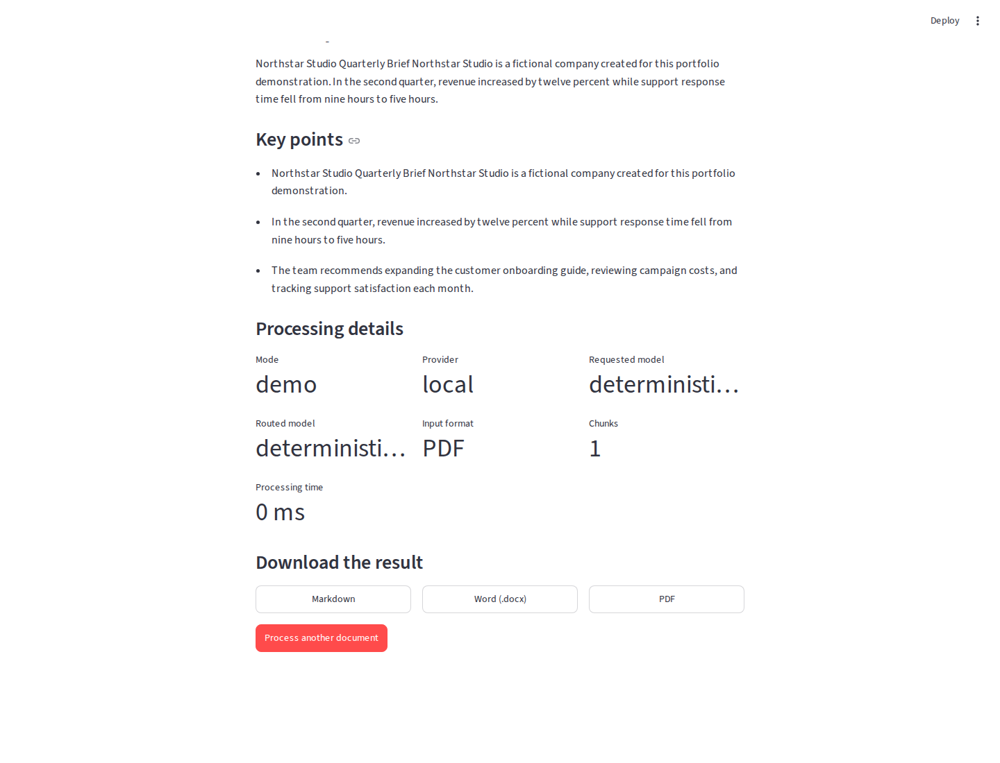

# Document Intelligence Pipeline

A portfolio-ready document processing application for turning business files
into structured summaries and downloadable reports.

Upload a PDF, DOCX, TXT, HTML, or CSV document. The application validates and
extracts the content, processes it in deterministic offline mode or through
OpenRouter, stores the job and result in SQLite, and exports the result as
Markdown, Word, or PDF.



## What a client gets

- A clear upload and bundled-sample workflow.
- Structured summary, key points, language, and source word count.
- Processing metadata for auditability: mode, provider, model, format, chunks,
  and duration.
- Durable job and result records that survive an API restart.
- Markdown and Unicode-safe DOCX exports.
- PDF export for Latin-1 results, with a visible fallback to Markdown or DOCX
  for other scripts.
- A deterministic, network-free demo mode that works without an API key.
- An optional live OpenRouter adapter with validated responses, bounded
  retries, and client-safe failures.







## Architecture

```text
Browser
  |
  v
Streamlit UI :8501
  |
  | HTTP
  v
FastAPI :8000
  |
  +--> bounded validation and format detection
  +--> extraction -> cleaning -> chunking
  +--> deterministic demo provider OR OpenRouter
  +--> SQLite job/result store
```

FastAPI background tasks are intentionally used for this single-process
portfolio release. A production multi-worker system should replace them with
an external queue.

## Supported formats

| Format | Processing | Limitation |
| --- | --- | --- |
| PDF | Text extraction with pypdf | No OCR for scanned/image-only PDFs |
| DOCX | Paragraph extraction with python-docx | Unsafe ZIP expansion is rejected before parsing |
| TXT | UTF-8 text decoding | Invalid bytes are safely replaced |
| HTML | Visible text; scripts and styles removed | It is not a browser renderer |
| CSV | Rows converted to readable text | CSV/plain-text MIME ambiguity is validated explicitly |

Uploads are read with a configured byte limit. Raw source files are not stored
after processing. SQLite stores safe file metadata, lifecycle state, result,
and provider/model metadata.

## Quick start: offline demo

Requirements: Python 3.11+, [uv](https://docs.astral.sh/uv/), and system
`libmagic`.

```bash
uv sync --group dev --no-lock
cp .env.example .env
```

Run the API:

```bash
uv run --no-sync uvicorn backend.main:app --reload
```

Run the UI in a second terminal:

```bash
uv run --no-sync streamlit run frontend/app.py
```

Open `http://localhost:8501`. Demo mode is deterministic, offline, and does
not need an API key.

## Docker

```bash
docker compose up --build
```

Open:

- UI: `http://localhost:8501`
- API docs: `http://localhost:8000/docs`
- Health: `http://localhost:8000/health`

The Compose setup uses a named volume for SQLite results.

## Optional OpenRouter mode

Set these values in `.env`:

```dotenv
SUMMARY_MODE=openrouter
OPENROUTER_API_KEY=replace_with_your_key
OPENROUTER_MODEL=meta-llama/llama-3.3-70b-instruct:free
```

Model availability and free-tier quotas are controlled by OpenRouter and can
change. The application records the requested and routed model when the
provider returns that metadata. Tests never contact OpenRouter.

## API

| Method | Endpoint | Purpose |
| --- | --- | --- |
| `GET` | `/health` | Database health and current processing mode |
| `POST` | `/process` | Validate and enqueue a multipart document |
| `GET` | `/jobs/{job_id}` | Read lifecycle state and safe source metadata |
| `GET` | `/jobs/{job_id}/result` | Read a completed structured result |

Lifecycle:

```text
PENDING -> PROCESSING -> COMPLETED
                     \-> FAILED
```

Interrupted `PROCESSING` records are marked failed on startup with a stable
re-upload message. Invalid uploads are rejected before a job is created.

## Quality evidence

All automated tests are offline.

```bash
uv run --no-sync python -m compileall -q backend frontend tests
uv run --no-sync ruff check .
uv run --no-sync ruff format --check .
uv run --no-sync pytest -q
uv run --no-sync python scripts/generate_samples.py --check
```

Coverage includes:

- Typed configuration and keyless startup.
- Deterministic demo and mocked OpenRouter failures.
- SQLite lifecycle, restart persistence, and corrupted-state handling.
- Five-format extraction and full API integration.
- DOCX archive-expansion safeguards.
- Streamlit buyer states and safe sample selection.
- Markdown, DOCX, and PDF export behavior.

GitHub Actions runs the same offline compile, lint, format, sample, and test
gates.

## Data and security behavior

- Raw source bytes exist only during processing and are not saved.
- Routine logs exclude document text, filenames, and API keys.
- Filenames are reduced to safe basenames and control characters are rejected.
- DOCX archive metadata is checked before extraction to prevent extreme
  decompression.
- The project is a portfolio demonstration, not a compliance-certified or
  multi-tenant production service.

## What I can customize

- Supported input formats and validation rules.
- Summary fields and output schema.
- Prompts, provider, and OpenRouter model selection.
- Export templates and branding.
- REST API integrations and webhook delivery.
- Authentication, retention, queues, and deployment architecture for a
  production engagement.

## Known limitations

- OCR is not included.
- Background work is in-process and does not resume after a crash.
- SQLite is intended for a single local/demo service.
- PDF export is Latin-1 only; Markdown and DOCX preserve Unicode.
- Public hosting, accounts, billing, and compliance controls are not included.

## License

[MIT](LICENSE)
